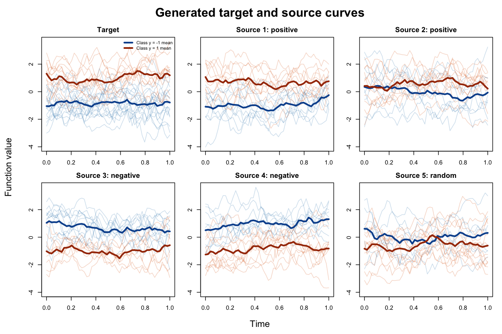

# An Adaptive Transfer Learning Framework for Functional Classification

Welcome! This repository is the code companion for our paper **"An Adaptive Transfer Learning Framework for Functional Classification"**, by Caihong Qin, Jinhan Xie, Ting Li, and Yang Bai.

The paper was published in *Journal of the American Statistical Association*, Volume 120, Issue 550, pages 1201--1213, with DOI: https://doi.org/10.1080/01621459.2024.2403788.

The paper studies binary classification when the target functional dataset is small and several source datasets may be available. The main idea is to build a functional DWD classifier, evaluate how helpful each source dataset is for the target task, and transfer source information adaptively to reduce negative transfer.

## Example

The code below generates an example dataset and applies the transfer learning functions.

Install `MASS` if it is not already available:

```r
install.packages("MASS")
```

```r
# Load the functions for data generation, functional DWD, and transfer learning.
source("functional_transfer_learning.R")

# Generate target training/test data and candidate sources.
# The example has two positive sources, two negative sources, and one random source.
sample_data <- generate_transfer_learning_sample_data(seed = 2036)

# Target data are lists with x and y.
# x is an n by grid_size matrix of curves; y is a vector coded as -1 or 1.
target_data <- sample_data$target_train
target_test <- sample_data$target_test

# Sources are stored as a list; each source has the same list(x, y) structure.
sources <- sample_data$sources

# Save a six-panel figure showing the target and source curves by class.
grid <- seq(0, 1, length.out = ncol(target_data$x))
curve_range <- range(c(list(target_data$x), lapply(sources, function(data) data$x)))

plot_curve_panel <- function(data, title, show_legend = FALSE) {
  negative <- data$y == -1
  positive <- data$y == 1
  matplot(
    grid, t(data$x[negative, , drop = FALSE]),
    type = "l", lty = 1, col = adjustcolor("#2C7FB8", alpha.f = 0.25),
    ylim = curve_range, xlab = "", ylab = "", main = title
  )
  matlines(
    grid, t(data$x[positive, , drop = FALSE]),
    lty = 1, col = adjustcolor("#D95F02", alpha.f = 0.25)
  )
  lines(grid, colMeans(data$x[negative, , drop = FALSE]), col = "#08519C", lwd = 3)
  lines(grid, colMeans(data$x[positive, , drop = FALSE]), col = "#A63603", lwd = 3)
  if (show_legend) {
    legend(
      "topright", legend = c("Class y = -1 mean", "Class y = 1 mean"),
      col = c("#08519C", "#A63603"), lwd = 3, bty = "n", cex = 0.75
    )
  }
}

png("generated_target_functional_data.png", width = 1200, height = 800, res = 130)
par(mfrow = c(2, 3), mar = c(2.2, 2.8, 2.2, 0.8), oma = c(3, 3, 3, 0.5))
plot_curve_panel(target_data, "Target", show_legend = TRUE)
for (i in seq_along(sources)) {
  plot_curve_panel(sources[[i]], paste0("Source ", i, ": ", sample_data$source_info$type[i]))
}
mtext("Time", side = 1, outer = TRUE, line = 1.2)
mtext("Function value", side = 2, outer = TRUE, line = 1.2)
mtext("Generated target and source curves", outer = TRUE, cex = 1.35, font = 2, line = 0.5)
dev.off()

# Check the source types generated for this example.
sample_data$source_info

# Use the positive sources when the informative source set is known.
positive_sources <- sources[sample_data$positive_source_indices]

# Fit transfer learning when the positive source set is known.
known_fit <- fit_atl_known_sources(
  target_data = target_data,              # target training data
  source_data_list = positive_sources     # known positive sources
)

# Average transfer classifiers when the informative source set is unknown.
# The weights are estimated from internal cross-validation decision matrices.
averaged_fit <- average_transfer_fits(
  target_data = target_data,              # target training data
  source_data_list = sources,             # all candidate sources
  metric = "correlation",                 # rank sources by correlation
  mode = "debiased",                      # average debiased transfer fits
  adaptive = FALSE                        # fit the tsf1/tsf2 path used below
)

# Known positive-source case: target-only, transfer, debiased transfer, and ATL.
atl_choice <- known_fit$adaptive$choices[[1]]$correlation_choice
atl_fit <- if (atl_choice == "debiased") known_fit$tsf2 else known_fit$tsf1
known_errors <- c(
  target_only = misclassification_rate(known_fit$target_only, target_test),
  tsf1 = misclassification_rate(known_fit$tsf1, target_test),
  tsf2 = misclassification_rate(known_fit$tsf2, target_test),
  atl = misclassification_rate(atl_fit, target_test)
)

# Unknown source case: use ranked sources and DWD-loss model averaging.
unknown_final_fit <- averaged_fit$final_fit
unknown_errors <- c(
  target_only = misclassification_rate(unknown_final_fit$target_only, target_test),
  tsf1 = misclassification_rate(unknown_final_fit$tsf1, target_test),
  tsf2 = misclassification_rate(unknown_final_fit$tsf2, target_test),
  average = misclassification_rate(averaged_fit$fit, target_test)
)

atl_choice
known_errors
unknown_errors
```

The reported values are misclassification rates on the generated target test data. The fitted methods are:

- `target_only`: fits functional DWD using only the target training data.
- `tsf1`: pools the target data with the supplied source data and fits functional DWD without debiasing.
- `tsf2`: adds a target-data debiasing update to the pooled `tsf1` classifier.
- `atl`: adaptively selects between `tsf1` and `tsf2` using the bootstrap criterion.
- `average`: averages target-only and ranked-source debiased transfer classifiers using weights estimated by internal cross-validation.

Running the example gives:

```text
    source     type  h
1 source_1 positive  7
2 source_2 positive  7
3 source_3 negative  7
4 source_4 negative  7
5 source_5   random NA

[1] "pooled"

target_only        tsf1        tsf2         atl
      0.136       0.088       0.096       0.088

target_only        tsf1        tsf2     average
      0.136       0.498       0.100       0.094
```

Using only the target training data gives a misclassification rate of 13.6%. When the informative source set is known, the target data are combined with the two positive sources: `tsf1` gives 8.8% without debiasing, while `tsf2` gives 9.6% after debiasing. ATL selects the pooled `tsf1` classifier and therefore gives the lower rate of 8.8%.

When the informative source set is unknown, all five candidate sources are considered: two positive, two negative, and one random source. Pooling all selected sources without debiasing gives a `tsf1` rate of 49.8%, illustrating negative transfer. The debiased `tsf2` classifier reduces the rate to 10.0%, and model averaging further reduces it to 9.4%.

The code above saves the following figure of the generated target and source curves:



The six panels show the target data, two positive sources, two negative sources, and one random source. Thin lines show individual curves, while thick lines show the class-specific sample means. The positive sources broadly preserve the target class pattern, the negative sources reverse it, and the random source has a different relationship between curves and labels.

To use your own data, prepare the target and each source dataset as `list(x = x_matrix, y = y_vector)`. The matrix `x` should have one curve per row and one grid point per column. The vector `y` should use labels `-1` and `1`. All target and source matrices should be observed on the same grid. The code assumes this structure directly and does not recode labels or reshape data.

## Details

The repository includes:

- `functional_transfer_learning.R`: synthetic data generation, functional DWD, known-source adaptive transfer learning, source ranking, and ranked-path model averaging.
- `generated_target_functional_data.png`: a figure generated from the example target and source data.

Required R packages:

- `MASS` is used for `MASS::ginv()` in the model-averaging weight update.
- `stats` is used from standard R.

Main functions:

- `generate_synthetic_functional_data()`: generates one target, positive source, or random source dataset.
- `generate_transfer_learning_sample_data()`: generates target training, test, positive source, negative source, and random source datasets in one call using one seed.
- `fit_functional_dwd()`: fits the target-only functional DWD classifier.
- `fit_atl_known_sources()`: implements the known-informative-source transfer step (`tsf1`), debiased transfer step (`tsf2`), and adaptive choice between them.
- `average_transfer_fits()`: implements ranked-source transfer paths followed by the DWD-loss model-averaging weight update using internal cross-validation folds.
